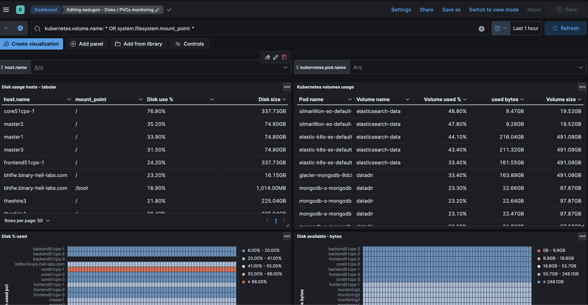
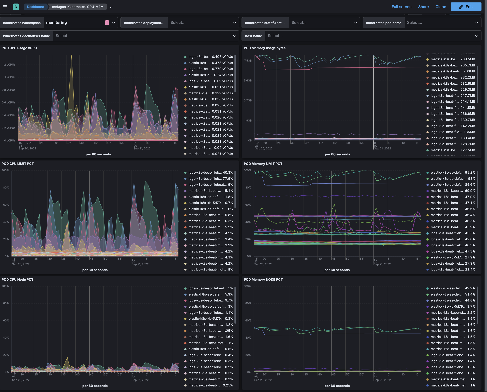

# kibana-k8s-explorer

Kibana dashboards for Kubernetes monitoring:
- Kubernetes Hosts and PVC disks monitoring
- POD CPU / MEM analyzer

Requirements:
- Kibana 8.4+
- Metricbeat configured to gather kubernetes metrics from all the nodes per [this doc](https://www.elastic.co/guide/en/beats/metricbeat/current/running-on-kubernetes.html)
- Filesystem metrics might require some tunning as described [here](), depending on the system and how Metricbeat is detecting the hosts filesystems.

## How to install the dashboards
- Find the appropriate file under the `resources/dashboards` directory of the repository.
- Open Kibana, Stack Management, Saved Objects, Import and select the `ndjson` file with the content.

## Kubernetes hosts disks and PVCs monitoring:

The following dashboard is useful to monitor together Kubernetes Volumes mounted on the pods (PersistentVolumeClaims for example) and the filesystems of Kubernetes hosts:

This dashboard improves the official Kubernetes Volumes dashboard, as that one doesn't consider the pods. And due to the fact that `volume names` are generic and typically reused among multiple pods, the metrics showed there don't mean much.

## POD CPU / MEM analyzer:

Json available [here](./resources/dashboards/eedugon-k8s-cpu-mem-dashboard-8.4.ndjson).

This dashboard is useful to analyze in real time the CPU and memory consumption of all the pods of the cluster. Besides the real usage of the resource (cores, MB of RAM) it also shows the percentage over its defined limit and the percentage over the node capacity:

Use cases:
- Check in real time the memory and CPU consumption of your pods.
- Detect pods close to their limit of resources (risk of being killed / throttled)
- Detect pods without limit (they will show same pct in relation with the limit than with the node)
- Check resources usage of pods running in a given host.
- Other filtering options: namespaces, daemonsets, statefulsets, deployments and pod name (to select specific pods)

