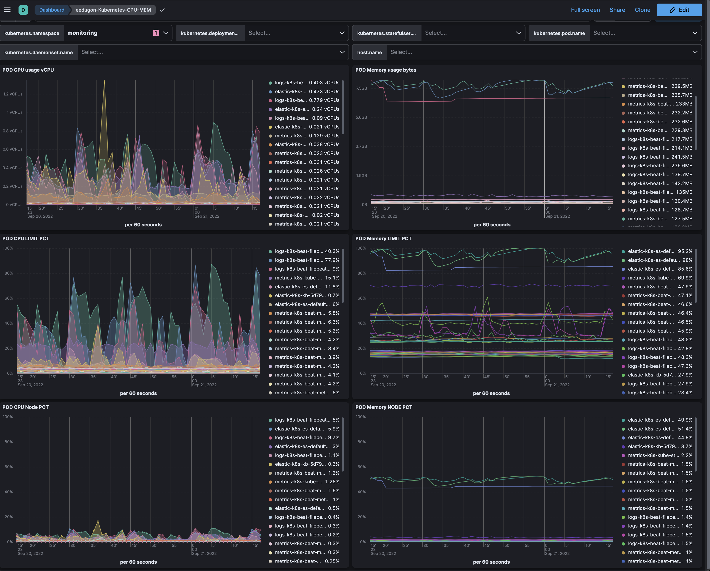

# kibana-k8s-explorer

Kibana dashboards for Kubernetes monitoring.

Requirements:
- Kibana 8.4
- Metricbeat configured to gather kubernetes metrics from all the nodes per [this doc](https://www.elastic.co/guide/en/beats/metricbeat/current/running-on-kubernetes.html)

This is the first dashboard I have created for Kubernetes monitoring:

## POD CPU / MEM analyzer:

Json available [here](./resources/eedugon-k8s-cpu-mem-dashboard-8.4.ndjson).

This dashboard is useful to analyze in real time the CPU and memory consumption of all the pods of the cluster. Besides the real usage of the resource (cores, MB of RAM) it also shows the percentage over its defined limit and the percentage over the node capacity:

Use cases:
- Check in real time the memory and CPU consumption of your pods.
- Detect pods close to their limit of resources (risk of being killed / throttled)
- Detect pods without limit (they will show same pct in relation with the limit)
- Check resources usage of pods of a given host
- Other filtering options: namespaces, daemonsets, statefulsets, deployments and pod name (to select specific pods)

How to install:
- Open Kibana, Stack Management, Saved Objects, Import and select the `ndjson` file with the content.
